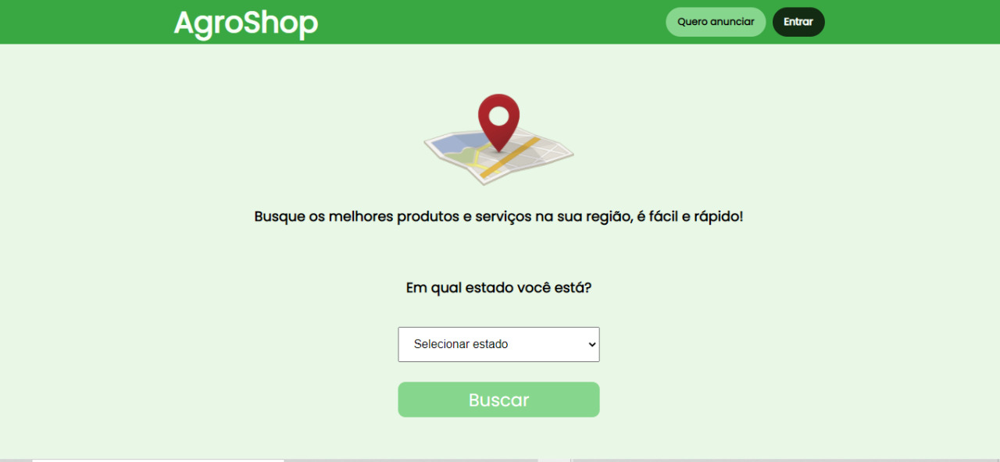

<h1 align="center">
  AgroShop
</h1>

<p align="center">
  
  
  
  
  <a href="https://github.com/alequisk/hackathon-crateus/commits/master">
    
  </a>
  
  

  
	 
</p>
<p align="center">
  <a href="#-sobre-o-projeto">Sobre o projeto</a>&nbsp;&nbsp;&nbsp;|&nbsp;&nbsp;&nbsp;
  <a href="#-tecnologias">Tecnologias</a>&nbsp;&nbsp;&nbsp;|&nbsp;&nbsp;&nbsp;
  <a href="#-instalação-execução-e-desenvolvimento">Instalação, execução e desenvolvimento</a>&nbsp;&nbsp;&nbsp;|&nbsp;&nbsp;&nbsp;
  <a href="#-como-contribuir">Como contribuir</a>&nbsp;&nbsp;&nbsp;|&nbsp;&nbsp;&nbsp;
  <a href="#-license">License</a>
</p>
<div align="center"><a id="insomniaButton" href="https://insomnia.rest/run/?label=AgroShop&uri=https%3A%2F%2Fgithub.com%2Falequisk%2Finsomnia%2Fblob%2Fmaster%2FInsomnia_2021-03-10" target="_blank" ></a>
</div>



## 👨🏻‍💻 Sobre o projeto
<p>Nossa plataforma aproxima quem quer comprar de quem quer vender. Eles mesmo se comunicam, e negociam os valores e a entrega. Sem atravessador e sem custo nenhum para o produtor e parar o consumidor.
</p>

## 🚀 Tecnologias

- [Node.js](https://nodejs.org/en/)
- [ReactJS](https://reactjs.org/)
- [Express](https://expressjs.com/pt-br/)
- [Prettier](https://prettier.io/)
- [EditorConfig](https://editorconfig.org/)
- [TypeScript](https://www.typescriptlang.org/)
- [JSON Web Tokens](https://jwt.io/)
- [UUID v4](https://www.uuidgenerator.net/version4)
- [MySQL](https://www.mysql.com/)
- [Docker](https://www.docker.com/)
- [TypeORM](https://typeorm.io/#/)

## 💻 Instalação, execução e desenvolvimento

Importe o `Insomnia.json` no Insomnia App ou click no botão [Run in Insomnia](#insomniaButton)

### Pré-requisitos

- [Node.js](https://nodejs.org/en/)
- [Yarn](https://classic.yarnpkg.com/) ou [npm](https://www.npmjs.com/)

### Backend

```bash
# Faça o downloald do projeto no seu computador
$ git clone https://github.com/alequisk/hackathon-crateus

# Crie um container docker com o mysql na versão 5
sudo docker run --name mysql-server-5 -e MYSQL_ROOT_PASSWORD=<sua-senha> -dp 3306:3306 mysql:5

# Entre na pasta raiz do projeto
$ cd hackathon-crateus

# Entre na pasta backend
$ cd backend

# Instale as dependências do node
$ yarn install

# Modifique as os configurações do banco
$ vim src/configs/environment.ts

# Configure a cli do typeorm
$ vim ormconfig.json

# Rode as migrations do banco de dados
$ yarn typeorm migration:run

# Tudo pronto para iniciar o servidor
$ yarn dev

```

### Web
```bash
# Entre na pasta frontend
$ cd frontend

# Instale as dependências
$ yarn install

# Tudo pronto para iniciar a aplicação web
$ yarn start

```
## 🤔 Como contribuir

**Faça um fork deste repositório e siga os passos a baixo**

```bash
# Clone seu fork
$ git clone seu-fork-url && cd NOME_DO_REPO

# Crie uma branch com sua feature
$ git checkout -b my-feature

# Faça commit das suas alterações
$ git commit -m 'feat: My new feature'

# Envie o código para sua remote branch
$ git push origin my-feature
```
Despois que sua pull request for merged, você pode deletar sua branch

## 📝 License

Esse projeto possui uma Licensa MIT License - veja o arquivo [LICENSE](LICENSE) para mais detalhes.

---

<div align="center">

Feito com ❤️

</div>
